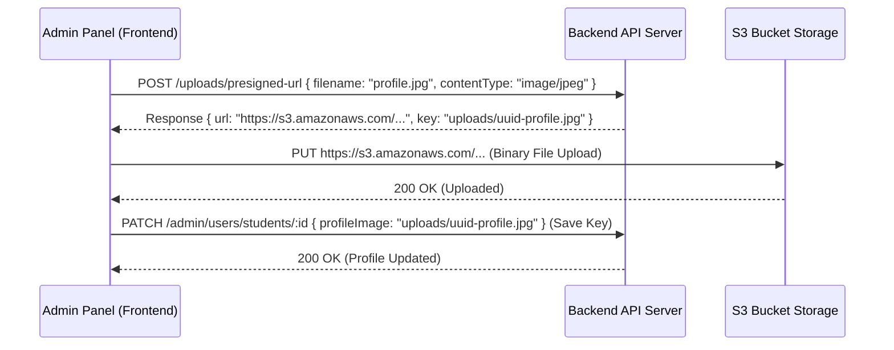

# StudySwap Admin Panel Implementation Plan & Guide

This guide describes the complete implementation blueprint for building the front-end Admin Panel of StudySwap. It defines the layout structure, sidebar menus, page views, file upload flows, specific CRUD operations, and detailed API routes with payload schemas and responses.

All admin API routes are prefixed with `/admin`. All endpoints (except login) require a Bearer token via `Authorization: Bearer <token>`.

---

## 1. Sidebar Menu & Layout Structure

The admin panel should use a standard double-column layout: a collapsible **Sidebar Navigation** on the left and the **Main Work Area** on the right with a global header displaying the active admin profile and a sign-out button.

### Sidebar Menu Structure

| Menu Item | Icon (Suggested) | Submenu / Sections | Primary Purpose |
| :--- | :--- | :--- | :--- |
| **Dashboard** | `LayoutDashboard` | *None* | Overview of stats, signups charts, popular exams, top mentors. |
| **User Management** | `Users` | All Users, Students, Mentors (Users) | Full user account control, profile overrides, account deletion, user-exams. |
| **Mentor Directory** | `GraduationCap` | All Mentors, Mentor Detail, Plans, Availability, Verification | Management of mentor profiles, hourly pricing, verification, plans, and availability. |
| **Bookings** | `Calendar` | All Bookings, Booking Detail | Platform-wide calendar schedules, billing status, Google Meet links management. |
| **Matching & Swipes** | `HeartHandshake` | *None* | Audit active student matching pairs, force deletion of bad matches. |
| **Geography & Exams** | `Globe` | Countries, Exams Config | Settings for available countries (ISO code/flag) and exams. |
| **System Audit** | `ShieldAlert` | *None* | Read-only stream of security events, admin actions, and errors. |

---

## 2. Core Frontend Patterns & Upload Flow

### Admin Token & Interceptor

All endpoints (except login) require a Bearer token:
```
Authorization: Bearer <token>
```

Store this token in local storage or secure cookies. Configure an Axios interceptor to append this header and automatically redirect users to `/login` upon receiving a `401 Unauthorized` response.

### File Upload Flow (Presigned S3 URL)

Admins need to upload profile images or country flags. **Do not send raw file binaries to update APIs.** Use the presigned URL flow:



1. **Get Presigned URL:**
   - **Route:** `POST /uploads/presigned-url`
   - **Body:** `{ "filename": "avatar.png", "contentType": "image/png" }`
   - **Response:** `{ "success": true, "data": { "url": "https://...", "key": "uploads/..." } }`
2. **Direct Upload:** Perform a `PUT` request directly to the returned `url` with the file binary as the payload and set `Content-Type: image/png`.
3. **Database Save:** Take the returned S3 `key` (public storage path) and pass it in the corresponding field (e.g. `profileImage` or `profile_image`) of your update/patch request.

---

## 3. Detailed Route Reference & Schema Models

### 3.1 Authentication

#### 1. Admin Login
- **Method:** `POST`
- **Path:** `/admin/auth/login`
- **Body:**
  ```json
  {
    "email": "admin@example.com",
    "password": "secure-admin-password"
  }
  ```
- **Response (200 OK):**
  ```json
  {
    "success": true,
    "message": "Admin login successful",
    "data": {
      "token": "jwt_token_string",
      "user": { "id": "00000000-0000-0000-0000-000000000000", "email": "admin@example.com", "role": "admin" }
    }
  }
  ```

#### 2. Get Current Admin Profile
- **Method:** `GET`
- **Path:** `/admin/auth/me`
- **Headers:** `Authorization: Bearer <token>`
- **Response (200 OK):**
  ```json
  {
    "success": true,
    "message": "Admin details fetched",
    "data": {
      "user": {
        "id": "00000000-0000-0000-0000-000000000000",
        "email": "admin@example.com",
        "role": "admin",
        "emailVerified": true,
        "onboardingCompleted": true
      }
    }
    }
  }
  ```

---

### 3.2 Dashboard Statistics

#### Get Dashboard Summary & Charts
- **Method:** `GET`
- **Path:** `/admin/dashboard`
- **Headers:** `Authorization: Bearer <token>`
- **Response (200 OK):**
  ```json
  {
    "success": true,
    "message": "Dashboard data fetched",
    "data": {
      "overview": {
        "totalUsers": 120,
        "totalStudents": 80,
        "totalMentors": 40,
        "verifiedMentors": 32,
        "unverifiedMentors": 8,
        "totalBookings": 150,
        "activeBookings": 12,
        "completedBookings": 100,
        "cancelledBookings": 10,
        "totalRevenue": 4850.50,
        "totalMatches": 240,
        "totalConversations": 180,
        "totalMessages": 5600
      },
      "charts": {
        "userSignups": [
          { "date": "2026-07-01T00:00:00.000Z", "students": 5, "mentors": 2 }
        ],
        "bookingsByStatus": { "pending": 10, "confirmed": 100, "completed": 30, "cancelled": 10 },
        "revenueByMonth": [
          { "month": "2026-07", "revenue": 4850.50 }
        ],
        "topMentors": [
          { "mentorId": "uuid", "name": "Jane Tutor", "profileImage": null, "totalBookings": 25, "revenue": 1200.00 }
        ],
        "topExams": [
          { "examId": "uuid", "name": "UPSC", "countryName": "India", "studentCount": 42 }
        ]
      }
    }
  }
  ```

---

### 3.3 User Management

#### 1. List All Users (Paginated & Searchable)
- **Method:** `GET`
- **Path:** `/admin/users`
- **Headers:** `Authorization: Bearer <token>`
- **Query Parameters:**
  - `page` (default: 1)
  - `limit` (default: 20, max 100)
  - `search` (search by name or email, optional)
- **Response (200 OK):**
  ```json
  {
    "success": true,
    "message": "Users fetched successfully",
    "data": [
      {
        "id": "uuid",
        "email": "user@example.com",
        "role": "student",
        "email_verified": true,
        "onboarding_completed": true,
        "created_at": "2026-07-01T12:00:00.000Z",
        "full_name": "John Doe",
        "profile_image": "uploads/avatar.png"
      }
    ],
    "pagination": { "page": 1, "limit": 20, "total": 120, "totalPages": 6 }
  }
  ```

#### 2. List Students Only (Paginated & Searchable)
- **Method:** `GET`
- **Path:** `/admin/users/students`
- **Headers:** `Authorization: Bearer <token>`
- **Query Parameters:** `page`, `limit`, `search`
- **Response:** Same shape as "List All Users" but filtered to `role = 'student'`.

#### 3. List Mentor Users Only (Paginated & Searchable)
- **Method:** `GET`
- **Path:** `/admin/users/mentors`
- **Headers:** `Authorization: Bearer <token>`
- **Query Parameters:** `page`, `limit`, `search`
- **Response:** Same shape as "List All Users" but filtered to `role = 'mentor'`.

#### 4. Get User By ID (Deep Profile Inspection)
- **Method:** `GET`
- **Path:** `/admin/users/:id`
- **Headers:** `Authorization: Bearer <token>`
- **Response (200 OK):**
  ```json
  {
    "success": true,
    "message": "User fetched",
    "data": {
      "user": {
        "id": "uuid",
        "email": "student@example.com",
        "role": "student",
        "email_verified": true,
        "onboarding_completed": true,
        "created_at": "2026-07-01T12:00:00.000Z",
        "full_name": "Jane Doe",
        "profile_image": "uploads/avatar.jpg",
        "age": 21,
        "gender": "female",
        "state": "California",
        "country_id": "country_uuid",
        "country_name": "United States",
        "bio": "Bio description",
        "strong_in": "Math",
        "need_help_with": "Chemistry",
        "study_time": "evening",
        "looking_for": ["partner"],
        "exams": [
          { "id": "exam_uuid", "name": "SAT Prep", "country_name": "United States" }
        ],
        "matchStats": { "total": 5, "accepted": 2, "pending": 2, "rejected": 1, "saved": 0 },
        "mentor": null
      }
    }
  }
  ```

#### 5. Update Student (Admin)
- **Method:** `PATCH`
- **Path:** `/admin/users/students/:id`
- **Headers:** `Authorization: Bearer <token>`
- **Body (All fields optional):**
  ```json
  {
    "role": "student",
    "emailVerified": true,
    "onboardingCompleted": true,
    "fullName": "Jane Updated",
    "profileImage": "uploads/new-avatar.png",
    "age": 22,
    "gender": "female",
    "state": "Nevada",
    "countryId": "country_uuid",
    "bio": "Updated bio text",
    "strongIn": "Math",
    "needHelpWith": "Chemistry",
    "studyTime": "evening",
    "lookingFor": ["partner"],
    "examIds": ["exam_uuid_1", "exam_uuid_2"]
  }
  ```
- **Response (200 OK):** Returns the full user object (same shape as Get User By ID).

#### 6. Update Mentor User (Admin)
Updates general user details, profiles, AND active credentials for a mentor user.
- **Method:** `PATCH`
- **Path:** `/admin/users/mentors/:id`
- **Headers:** `Authorization: Bearer <token>`
- **Body (All fields optional — includes all student fields plus mentor-specific fields):**
  ```json
  {
    "fullName": "Jane Mentor",
    "profileImage": "uploads/mentor-avatar.png",
    "age": 30,
    "gender": "female",
    "state": "California",
    "countryId": "country_uuid",
    "bio": "Updated bio text",
    "strongIn": "Physics",
    "needHelpWith": "Advanced Mechanics",
    "studyTime": "morning",
    "lookingFor": ["students"],
    "title": "Lead Physics Tutor",
    "qualification": "PhD in Physics",
    "experienceYears": 8,
    "hourlyPrice": 95.0,
    "isVerified": true,
    "phoneNumber": "+1234567890",
    "examIds": ["exam_uuid"]
  }
  ```
- **Response (200 OK):** Returns the full user object with mentor data.

#### 7. Delete User Account
Deletes a user account. Automatically triggers cascading database deletion for matches, bookings, and slots.
- **Method:** `DELETE`
- **Path:** `/admin/users/:id`
- **Headers:** `Authorization: Bearer <token>`
- **Response (200 OK):**
  ```json
  {
    "success": true,
    "message": "User deleted",
    "data": {}
  }
  ```

---

### 3.4 Mentor Profiles Management

#### 1. List All Mentors (Enriched Details)
- **Method:** `GET`
- **Path:** `/admin/mentors`
- **Headers:** `Authorization: Bearer <token>`
- **Response (200 OK):**
  ```json
  {
    "success": true,
    "message": "Mentors fetched",
    "data": [
      {
        "id": "mentor_uuid",
        "user_id": "user_uuid",
        "title": "Lead Instructor",
        "qualification": "PhD in Mathematics",
        "experience_years": 5,
        "hourly_price": "50.00",
        "rating": "4.80",
        "total_reviews": 12,
        "about": "I help students excel.",
        "is_verified": true,
        "phone_number": "+1234567890",
        "created_at": "2026-07-01T12:00:00.000Z",
        "updated_at": "2026-07-05T12:00:00.000Z",
        "full_name": "Jane Doe",
        "profile_image": "uploads/avatar.png",
        "email": "jane@example.com",
        "total_bookings": 35
      }
    ]
  }
  ```

#### 2. Get Mentor Profile by ID
- **Method:** `GET`
- **Path:** `/admin/mentors/:id`
- **Headers:** `Authorization: Bearer <token>`
- **Response (200 OK):**
  ```json
  {
    "success": true,
    "message": "Mentor fetched",
    "data": {
      "id": "mentor_uuid",
      "user_id": "user_uuid",
      "title": "Lead Instructor",
      "qualification": "PhD in Mathematics",
      "experience_years": 5,
      "hourly_price": "50.00",
      "rating": "4.80",
      "total_reviews": 12,
      "about": "Chemistry tutor details",
      "is_verified": true,
      "phone_number": "+1234567890",
      "created_at": "2026-07-01T12:00:00.000Z",
      "updated_at": "2026-07-05T12:00:00.000Z",
      "full_name": "Jane Doe",
      "profile_image": "uploads/avatar.png",
      "email": "jane@example.com",
      "total_bookings": 35
    }
  }
  ```

#### 3. Update Mentor Profile (Direct)
- **Method:** `PATCH`
- **Path:** `/admin/mentors/:id`
- **Headers:** `Authorization: Bearer <token>`
- **Body (All fields optional):**
  ```json
  {
    "title": "Senior Math Tutor",
    "qualification": "PhD in Mathematics",
    "experience_years": 6,
    "hourly_price": 55.00,
    "is_verified": true,
    "phone_number": "+1234567890",
    "country_id": "country_uuid",
    "state": "California",
    "exam_ids": ["exam_uuid"]
  }
  ```
- **Response (200 OK):** Returns the updated mentor profile object.

#### 4. Toggle Mentor Verification
Quickly verify or unverify a mentor. Invoking this endpoint automatically clears the frontend public mentor cache.
- **Method:** `PATCH`
- **Path:** `/admin/mentors/:id/verify`
- **Headers:** `Authorization: Bearer <token>`
- **Response (200 OK):** Returns the updated mentor record.

#### 5. Delete Mentor
- **Method:** `DELETE`
- **Path:** `/admin/mentors/:id`
- **Headers:** `Authorization: Bearer <token>`
- **Response (200 OK):**
  ```json
  {
    "success": true,
    "message": "Mentor deleted",
    "data": {}
  }
  ```

---

### 3.5 Mentor Bookings Management

#### 1. List All Bookings (Paginated, Searchable, Filterable)
- **Method:** `GET`
- **Path:** `/admin/mentors/bookings`
- **Headers:** `Authorization: Bearer <token>`
- **Query Parameters:**
  - `page` (default: 1)
  - `limit` (default: 20, max 100)
  - `search` (search by mentor/student name or email, optional)
  - `status` (filter: `pending`, `confirmed`, `completed`, `cancelled`, optional)
- **Response (200 OK):**
  ```json
  {
    "success": true,
    "message": "Bookings fetched successfully",
    "data": [
      {
        "id": "booking_uuid",
        "student_id": "student_uuid",
        "mentor_id": "mentor_uuid",
        "plan_id": "plan_uuid",
        "slot_id": "slot_uuid",
        "status": "confirmed",
        "payment_status": "paid",
        "amount": "60.00",
        "meeting_link": "https://meet.google.com/abc-xyz-123",
        "google_event_id": "google_event_id",
        "google_meet_url": "https://meet.google.com/abc-xyz-123",
        "google_calendar_url": "https://calendar.google.com/...",
        "meeting_provider": "GOOGLE_MEET",
        "created_at": "2026-07-04T10:00:00.000Z",
        "updated_at": "2026-07-04T10:00:00.000Z",
        "mentor_name": "Jane Doe",
        "mentor_email": "jane@example.com",
        "student_name": "Alex Student",
        "student_email": "alex@example.com",
        "plan_title": "1-Hour Session",
        "duration_minutes": 60,
        "start_time": "2026-07-06T10:00:00.000Z",
        "end_time": "2026-07-06T11:00:00.000Z"
      }
    ],
    "pagination": { "page": 1, "limit": 20, "total": 45, "totalPages": 3 }
  }
  ```

#### 2. Get Booking by ID
- **Method:** `GET`
- **Path:** `/admin/mentors/bookings/:id`
- **Headers:** `Authorization: Bearer <token>`
- **Response (200 OK):** Returns a single booking object (same shape as list item).

#### 3. Get Bookings by Mentor
- **Method:** `GET`
- **Path:** `/admin/mentors/:id/bookings`
- **Headers:** `Authorization: Bearer <token>`
- **Response (200 OK):**
  ```json
  {
    "success": true,
    "message": "Mentor bookings fetched",
    "data": { "bookings": [ ... ] }
  }
  ```

#### 4. Update Booking (Status or Payment)
- **Method:** `PATCH`
- **Path:** `/admin/mentors/bookings/:id`
- **Headers:** `Authorization: Bearer <token>`
- **Body (All fields optional):**
  ```json
  {
    "status": "completed",
    "payment_status": "paid"
  }
  ```
  Valid status values: `pending`, `confirmed`, `completed`, `cancelled`
  Valid payment_status values: `pending`, `paid`, `refunded`
- **Response (200 OK):** Returns the updated booking object.

#### 5. Regenerate Google Meet Link
Destroys the old Google Calendar event (if any) and creates a fresh meeting link.
- **Method:** `PATCH`
- **Path:** `/admin/mentors/bookings/:id/regenerate-meet`
- **Headers:** `Authorization: Bearer <token>`
- **Response (200 OK):**
  ```json
  {
    "success": true,
    "message": "Google Meet link regenerated",
    "data": {
      "meetUrl": "https://meet.google.com/new-link-code",
      "calendarUrl": "https://calendar.google.com/...",
      "eventId": "new_google_event_id"
    }
  }
  ```

#### 6. Delete Booking
- **Method:** `DELETE`
- **Path:** `/admin/mentors/bookings/:id`
- **Headers:** `Authorization: Bearer <token>`
- **Response (200 OK):**
  ```json
  {
    "success": true,
    "message": "Booking deleted",
    "data": {}
  }
  ```

---

### 3.6 Plans & Availability Sub-management

#### 1. Get Mentor Plans
- **Method:** `GET`
- **Path:** `/admin/mentors/:id/plans`
- **Headers:** `Authorization: Bearer <token>`
- **Response (200 OK):**
  ```json
  {
    "success": true,
    "message": "Mentor plans fetched",
    "data": { "plans": [ ... ] }
  }
  ```

#### 2. Update Mentor Plan (Direct)
- **Method:** `PATCH`
- **Path:** `/admin/mentors/plans/:id`
- **Headers:** `Authorization: Bearer <token>`
- **Body (All fields optional):**
  ```json
  {
    "title": "Calculus Advanced",
    "description": "2-hour deep dive",
    "duration_minutes": 120,
    "price": 80.0,
    "is_active": true
  }
  ```
- **Response (200 OK):** Returns the updated plan object.

#### 3. Delete Mentor Plan
- **Method:** `DELETE`
- **Path:** `/admin/mentors/plans/:id`
- **Headers:** `Authorization: Bearer <token>`
- **Response (200 OK):**
  ```json
  {
    "success": true,
    "message": "Plan deleted",
    "data": {}
  }
  ```

#### 4. Get Mentor Availability
- **Method:** `GET`
- **Path:** `/admin/mentors/:id/availability`
- **Headers:** `Authorization: Bearer <token>`
- **Response (200 OK):**
  ```json
  {
    "success": true,
    "message": "Mentor availability fetched",
    "data": [
      { "day_of_week": 1, "start_time": "09:00:00", "end_time": "17:00:00" }
    ]
  }
  ```

#### 5. Update Mentor Availability
Overwrites the entire availability schedule for a mentor.
- **Method:** `PUT`
- **Path:** `/admin/mentors/:id/availability`
- **Headers:** `Authorization: Bearer <token>`
- **Body:**
  ```json
  {
    "availability": [
      { "day_of_week": 1, "start_time": "09:00:00", "end_time": "17:00:00" },
      { "day_of_week": 2, "start_time": "09:00:00", "end_time": "17:00:00" },
      { "day_of_week": 3, "start_time": "09:00:00", "end_time": "17:00:00" }
    ]
  }
  ```
  - `day_of_week`: 0 (Sunday) through 6 (Saturday)
  - Time format: `HH:MM:SS` (24-hour, zero-padded)
  - Max 50 entries
- **Response (200 OK):** Returns the updated availability array.

---

### 3.7 Matches & Swiping Audit

#### 1. List Matches (Paginated)
- **Method:** `GET`
- **Path:** `/admin/matches`
- **Headers:** `Authorization: Bearer <token>`
- **Query Parameters:**
  - `page` (default: 1)
  - `limit` (default: 20)
- **Response (200 OK):**
  ```json
  {
    "success": true,
    "message": "Matches fetched successfully",
    "data": [
      {
        "id": "match_uuid",
        "user_id": "user1_uuid",
        "matched_user_id": "user2_uuid",
        "status": "accepted",
        "matched_at": null,
        "created_at": "2026-07-04T12:00:00.000Z",
        "updated_at": "2026-07-04T12:00:00.000Z",
        "user_name": "Alex Smith",
        "user_email": "alex@example.com",
        "matched_user_name": "Sarah Miller",
        "matched_user_email": "sarah@example.com"
      }
    ],
    "pagination": { "page": 1, "limit": 20, "total": 240, "totalPages": 12 }
  }
  ```

#### 2. Get Matches by User
- **Method:** `GET`
- **Path:** `/admin/matches/user/:userId`
- **Headers:** `Authorization: Bearer <token>`
- **Response (200 OK):**
  ```json
  {
    "success": true,
    "message": "User matches fetched",
    "data": { "matches": [ ... ] }
  }
  ```

#### 3. Delete Match (Separates Matching Pairs)
- **Method:** `DELETE`
- **Path:** `/admin/matches/:id`
- **Headers:** `Authorization: Bearer <token>`
- **Response (200 OK):**
  ```json
  {
    "success": true,
    "message": "Match deleted",
    "data": {}
  }
  ```

---

### 3.8 Geography & Exams Settings

#### 1. List Countries (Paginated & Searchable)
- **Method:** `GET`
- **Path:** `/admin/countries`
- **Headers:** `Authorization: Bearer <token>`
- **Query Parameters:**
  - `page` (default: 1)
  - `limit` (default: 20)
  - `search` (search by name, optional)
- **Response (200 OK):**
  ```json
  {
    "success": true,
    "message": "Countries fetched successfully",
    "data": [
      {
        "id": "country_uuid",
        "name": "United States",
        "flag": null,
        "iso_code": "US",
        "created_at": "2026-07-01T12:00:00.000Z",
        "updated_at": "2026-07-01T12:00:00.000Z"
      }
    ],
    "pagination": { "page": 1, "limit": 20, "total": 50, "totalPages": 3 }
  }
  ```

#### 2. Create Country
- **Method:** `POST`
- **Path:** `/admin/countries`
- **Headers:** `Authorization: Bearer <token>`
- **Body:**
  ```json
  {
    "name": "Germany",
    "isoCode": "DE",
    "flag": null
  }
  ```
  - `isoCode`: Exactly 2 characters, uppercased automatically
  - `flag`: Optional, nullable
- **Response (201 Created):**
  ```json
  {
    "success": true,
    "message": "Country created",
    "data": { "country": { ... } }
  }
  ```

#### 3. Update Country
- **Method:** `PATCH`
- **Path:** `/admin/countries/:id`
- **Headers:** `Authorization: Bearer <token>`
- **Body (All fields optional):**
  ```json
  {
    "name": "Germany Updated",
    "isoCode": "DE",
    "flag": null
  }
  ```
- **Response (200 OK):** Returns the updated country object.

#### 4. Delete Country
- **Method:** `DELETE`
- **Path:** `/admin/countries/:id`
- **Headers:** `Authorization: Bearer <token>`
- **Response (200 OK):**
  ```json
  {
    "success": true,
    "message": "Country deleted",
    "data": {}
  }
  ```

#### 5. Get Exams by Country
- **Method:** `GET`
- **Path:** `/admin/countries/:countryId/exams`
- **Headers:** `Authorization: Bearer <token>`
- **Response (200 OK):**
  ```json
  {
    "success": true,
    "message": "Exams fetched",
    "data": { "exams": [ ... ] }
  }
  ```

#### 6. List All Exams (Paginated & Searchable)
- **Method:** `GET`
- **Path:** `/admin/exams`
- **Headers:** `Authorization: Bearer <token>`
- **Query Parameters:** `page`, `limit`, `search`
- **Response (200 OK):**
  ```json
  {
    "success": true,
    "message": "Exams fetched successfully",
    "data": [
      {
        "id": "exam_uuid",
        "country_id": "country_uuid",
        "name": "SAT Prep",
        "is_active": true,
        "created_at": "2026-07-01T12:00:00.000Z",
        "updated_at": "2026-07-01T12:00:00.000Z"
      }
    ],
    "pagination": { "page": 1, "limit": 20, "total": 15, "totalPages": 1 }
  }
  ```

#### 7. Create Exam
- **Method:** `POST`
- **Path:** `/admin/exams`
- **Headers:** `Authorization: Bearer <token>`
- **Body:**
  ```json
  {
    "name": "IIT-JEE",
    "countryId": "country_uuid",
    "isActive": true
  }
  ```
- **Response (201 Created):**
  ```json
  {
    "success": true,
    "message": "Exam created",
    "data": { ... }
  }
  ```

#### 8. Update Exam
- **Method:** `PATCH`
- **Path:** `/admin/exams/:id`
- **Headers:** `Authorization: Bearer <token>`
- **Body (All fields optional):**
  ```json
  {
    "name": "IIT-JEE Advanced",
    "countryId": "country_uuid",
    "isActive": true
  }
  ```
- **Response (200 OK):** Returns updated exam object.

#### 9. Delete Exam
- **Method:** `DELETE`
- **Path:** `/admin/exams/:id`
- **Headers:** `Authorization: Bearer <token>`
- **Response (200 OK):**
  ```json
  {
    "success": true,
    "message": "Exam deleted",
    "data": {}
  }
  ```

---

### 3.9 System Audit Logs

#### Fetch System Audit Trails
- **Method:** `GET`
- **Path:** `/admin/audit-logs`
- **Headers:** `Authorization: Bearer <token>`
- **Query Parameters:**
  - `page` (default: 1)
  - `limit` (default: 50, max 100)
  - `userId` (filter by action performer UUID, optional)
  - `action` (filter by action string, e.g. `PATCH /admin/mentors/:id/verify`, optional)
  - `from` (ISO timestamp start range, optional)
  - `to` (ISO timestamp end range, optional)
- **Response (200 OK):**
  ```json
  {
    "success": true,
    "message": "Audit logs fetched successfully",
    "data": [
      {
        "id": "log_uuid",
        "user_id": "admin_uuid",
        "action": "PATCH /admin/mentors/:id/verify",
        "entity": "mentors",
        "details": { "body": { "notes": "Mentor was verified" } },
        "ip_address": "127.0.0.1",
        "user_agent": "Mozilla/5.0 ...",
        "status_code": 200,
        "created_at": "2026-07-05T10:00:00.000Z"
      }
    ],
    "pagination": { "page": 1, "limit": 50, "total": 1250, "totalPages": 25 }
  }
  ```

Notes:
- The `action` field is the HTTP method + URL path (e.g. `PATCH /admin/mentors/:id/verify`)
- The `entity` field is derived from the route base (e.g. `admin`)
- The `details` field contains the cleaned request body, query params, and execution duration

---

## 4. Complete Route Table

| Method | Path | Description | Auth |
|--------|------|-------------|------|
| POST | `/admin/auth/login` | Admin login | No |
| GET | `/admin/auth/me` | Get current admin profile | Yes |
| GET | `/admin/dashboard` | Dashboard statistics & charts | Yes |
| GET | `/admin/users` | List all users (paginated, searchable) | Yes |
| GET | `/admin/users/students` | List students (paginated, searchable) | Yes |
| GET | `/admin/users/mentors` | List mentor users (paginated, searchable) | Yes |
| GET | `/admin/users/:id` | Get user by ID (deep profile) | Yes |
| PATCH | `/admin/users/students/:id` | Update student user | Yes |
| PATCH | `/admin/users/mentors/:id` | Update mentor user | Yes |
| DELETE | `/admin/users/:id` | Delete user account | Yes |
| GET | `/admin/mentors` | List all mentors | Yes |
| GET | `/admin/mentors/:id` | Get mentor by ID | Yes |
| PATCH | `/admin/mentors/:id` | Update mentor profile | Yes |
| DELETE | `/admin/mentors/:id` | Delete mentor | Yes |
| PATCH | `/admin/mentors/:id/verify` | Toggle mentor verification | Yes |
| GET | `/admin/mentors/:id/bookings` | Get bookings by mentor | Yes |
| GET | `/admin/mentors/:id/availability` | Get mentor availability | Yes |
| PUT | `/admin/mentors/:id/availability` | Update mentor availability | Yes |
| GET | `/admin/mentors/:id/plans` | Get mentor plans | Yes |
| GET | `/admin/mentors/bookings` | List all bookings (paginated, filterable) | Yes |
| GET | `/admin/mentors/bookings/:id` | Get booking by ID | Yes |
| PATCH | `/admin/mentors/bookings/:id` | Update booking status/payment | Yes |
| DELETE | `/admin/mentors/bookings/:id` | Delete booking | Yes |
| PATCH | `/admin/mentors/bookings/:id/regenerate-meet` | Regenerate Google Meet link | Yes |
| PATCH | `/admin/mentors/plans/:id` | Update mentor plan | Yes |
| DELETE | `/admin/mentors/plans/:id` | Delete mentor plan | Yes |
| GET | `/admin/matches` | List all matches (paginated) | Yes |
| GET | `/admin/matches/user/:userId` | Get matches by user | Yes |
| DELETE | `/admin/matches/:id` | Delete match | Yes |
| GET | `/admin/countries` | List countries (paginated, searchable) | Yes |
| POST | `/admin/countries` | Create country | Yes |
| PATCH | `/admin/countries/:id` | Update country | Yes |
| DELETE | `/admin/countries/:id` | Delete country | Yes |
| GET | `/admin/countries/:countryId/exams` | Get exams by country | Yes |
| GET | `/admin/exams` | List all exams (paginated, searchable) | Yes |
| POST | `/admin/exams` | Create exam | Yes |
| PATCH | `/admin/exams/:id` | Update exam | Yes |
| DELETE | `/admin/exams/:id` | Delete exam | Yes |
| GET | `/admin/audit-logs` | Get audit logs (paginated, filterable) | Yes |
