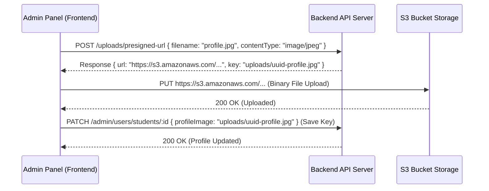

# StudySwap Admin Panel Implementation Plan & Guide

This guide describes the complete implementation blueprint for building the front-end Admin Panel of StudySwap. It defines the layout structure, sidebar menus, page views, file upload flows, specific CRUD operations, and detailed API routes with payload schemas and responses.

---

## 📂 1. Sidebar Menu & Layout Structure

The admin panel should use a standard double-column layout: a collapsible **Sidebar Navigation** on the left and the **Main Work Area** on the right with a global header displaying the active admin profile and a sign-out button.

### 🧭 Sidebar Menu Structure

| Menu Item | Icon (Suggested) | Submenu / Sections | Primary Purpose |
| :--- | :--- | :--- | :--- |
| **Dashboard** | `LayoutDashboard` | *None* | Overview of stats, signups charts, popular exams, top mentors. |
| **User Management** | `Users` | • **All Users**<br>• **Students**<br>• **Mentors (Users)** | Full user account control, profile overrides, account deletion, user-exams. |
| **Mentor Directory** | `GraduationCap` | • **Verified Mentors**<br>• **Applications Queue** | Management of mentor profiles, hourly pricing, verification, plans, and slots. |
| **Bookings** | `Calendar` | • **All Bookings**<br>• **Active Sessions** | Platform-wide calendar schedules, billing status, Google Meet links management. |
| **Matching & Swipes** | `HeartHandshake` | *None* | Audit active student matching swiping pairs, force deletion of bad matches. |
| **Geography & Exams**| `Globe` | • **Countries**<br>• **Exams Config** | Settings for available countries (ISO code/flag) and exams. |
| **System Audit** | `ShieldAlert` | *None* | Read-only stream of security events, admin actions, and errors. |

---

## 📷 2. Core Frontend Patterns & Upload Flow

### 🔒 Admin Token & Interceptor
All endpoints (except login) require a Bearer token: `Authorization: Bearer <token>`.
Store this token in local storage or secure cookies. Configure an Axios interceptor to append this header and automatically redirect users to `/login` upon receiving a `401 Unauthorized` response.

### 🖼️ File Upload Flow (Presigned S3 URL)
Admins need to upload profile images or country flags. **Do not send raw file binaries to update APIs.** Use the presigned URL flow:



1. **Get Presigned URL:**
   - **Route:** `POST /uploads/presigned-url`
   - **Body:** `{ "filename": "avatar.png", "contentType": "image/png" }`
   - **Response:** `{ "success": true, "data": { "url": "https://...", "key": "uploads/..." } }`
2. **Direct Upload:** Perform a `PUT` request directly to the returned `url` with the file binary as the payload and set `Content-Type: image/png`.
3. **Database Save:** Take the returned S3 `key` (public storage path) and pass it in the corresponding field (e.g. `profileImage` or `profile_image`) of your update/patch request.

---

## 🔌 3. Detailed Route Reference & Schema Models

### 🔐 3.1 Authentication

#### 1. Admin Login
- **Method:** `POST`
- **Path:** `/auth/login`
- **Body:**
  ```json
  {
    "email": "admin@example.com",
    "password": "secure-admin-password"
  }
  ```
- **Response (200 OK):**
  ```json
  {
    "success": true,
    "message": "Admin login successful",
    "data": {
      "token": "jwt_token_string",
      "user": { "id": "uuid", "email": "admin@example.com", "role": "admin" }
    }
  }
  ```

#### 2. Get Current Admin profile
- **Method:** `GET`
- **Path:** `/auth/me`
- **Response (200 OK):**
  ```json
  {
    "success": true,
    "data": { "id": "uuid", "email": "admin@example.com", "role": "admin" }
  }
  ```

---

### 📊 3.2 Dashboard Statistics

#### Get Dashboard Summary & Charts
- **Method:** `GET`
- **Path:** `/dashboard`
- **Response (200 OK):**
  ```json
  {
    "success": true,
    "data": {
      "overview": {
        "totalUsers": 120,
        "totalStudents": 80,
        "totalMentors": 40,
        "verifiedMentors": 32,
        "unverifiedMentors": 8,
        "totalBookings": 150,
        "activeBookings": 12,
        "totalRevenue": 4850.50
      },
      "charts": {
        "userSignups": [
          { "date": "2026-07-01", "students": 5, "mentors": 2 }
        ],
        "bookingsByStatus": { "pending": 10, "confirmed": 100, "completed": 30, "cancelled": 10 },
        "revenueByMonth": [
          { "month": "2026-07", "revenue": 4850.50 }
        ],
        "topMentors": [
          { "mentorId": "uuid", "name": "Jane Tutor", "revenue": 1200.00 }
        ],
        "topExams": [
          { "examId": "uuid", "name": "UPSC", "studentCount": 42 }
        ]
      }
    }
  }
  ```

---

### 👥 3.3 User Management

#### 1. List All Users (Paginated & Filterable)
- **Method:** `GET`
- **Path:** `/users`
- **Query Parameters:**
  - `page` (default: 1)
  - `limit` (default: 20)
  - `search` (Search by Name or Email)
- **Response (200 OK):**
  ```json
  {
    "success": true,
    "data": [
      {
        "id": "uuid",
        "email": "user@example.com",
        "role": "student",
        "email_verified": true,
        "onboarding_completed": true,
        "created_at": "2026-07-01T12:00:00Z",
        "full_name": "John Doe",
        "profile_image": "uploads/avatar.png"
      }
    ],
    "pagination": { "page": 1, "limit": 20, "total": 120, "totalPages": 6 }
  }
  ```

#### 2. Get User By ID (Deep Profile Inspection)
- **Method:** `GET`
- **Path:** `/users/:id`
- **Response (200 OK):**
  ```json
  {
    "success": true,
    "data": {
      "id": "uuid",
      "email": "student@example.com",
      "role": "student",
      "email_verified": true,
      "onboarding_completed": true,
      "created_at": "2026-07-01T12:00:00Z",
      "full_name": "Jane Doe",
      "profile_image": "uploads/avatar.jpg",
      "age": 21,
      "gender": "female",
      "state": "California",
      "country_id": "country_uuid",
      "country_name": "United States",
      "bio": "Bio description",
      "strong_in": "Math",
      "need_help_with": "Chemistry",
      "study_time": "evening",
      "looking_for": ["partner"],
      "exams": [
        { "id": "exam_uuid", "name": "SAT Prep", "country_name": "United States" }
      ],
      "matchStats": { "total": 5, "accepted": 2, "pending": 2, "rejected": 1, "saved": 0 },
      "mentor": null // populated if role is 'mentor'
    }
  }
  ```

#### 3. Update Student (Admin)
- **Method:** `PATCH`
- **Path:** `/users/students/:id`
- **Body (All fields optional):**
  ```json
  {
    "role": "student",
    "emailVerified": true,
    "onboardingCompleted": true,
    "fullName": "Jane Updated",
    "profileImage": "uploads/new-avatar.png",
    "age": 22,
    "gender": "female",
    "state": "Nevada",
    "countryId": "country_uuid",
    "bio": "Updated bio text",
    "examIds": ["exam_uuid_1", "exam_uuid_2"]
  }
  ```

#### 4. Update Mentor User (Admin)
Updates general user details, profiles, AND active credentials for a mentor user.
- **Method:** `PATCH`
- **Path:** `/users/mentors/:id`
- **Body (All fields optional):**
  ```json
  {
    "fullName": "Jane Mentor",
    "profileImage": "uploads/mentor-avatar.png",
    "age": 30,
    "gender": "female",
    "state": "California",
    "countryId": "country_uuid",
    "bio": "Updated bio text",
    "title": "Lead Physics Tutor",
    "qualification": "PhD in Physics",
    "experienceYears": 8,
    "hourlyPrice": 95.0,
    "isVerified": true,
    "examIds": ["exam_uuid"]
  }
  ```

#### 5. Delete User Account
Deletes a user account. Automatically triggers cascading database deletion for matches, bookings, and slots.
- **Method:** `DELETE`
- **Path:** `/users/:id`
- **Response (200 OK):**
  ```json
  {
    "success": true,
    "message": "User deleted successfully"
  }
  ```

---

### 🎓 3.4 Mentor Profiles Management

#### 1. List All Mentors (Enriched details)
- **Method:** `GET`
- **Path:** `/mentors`
- **Response (200 OK):**
  ```json
  {
    "success": true,
    "data": [
      {
        "id": "mentor_uuid",
        "user_id": "user_uuid",
        "title": "Lead Instructor",
        "qualification": "PhD in Mathematics",
        "experience_years": 5,
        "hourly_price": "50.00",
        "rating": "4.80",
        "total_reviews": 12,
        "is_verified": true,
        "full_name": "Jane Doe",
        "profile_image": "uploads/avatar.png",
        "email": "jane@example.com",
        "total_bookings": 35,
        "active_bookings": 3
      }
    ]
  }
  ```

#### 2. Get Mentor Profile by ID
- **Method:** `GET`
- **Path:** `/mentors/:id`
- **Response (200 OK):**
  ```json
  {
    "success": true,
    "data": {
      "id": "mentor_uuid",
      "user_id": "user_uuid",
      "title": "Lead Instructor",
      "qualification": "PhD in Mathematics",
      "experience_years": 5,
      "hourly_price": "50.00",
      "rating": "4.80",
      "total_reviews": 12,
      "about": "Chemistry tutor details",
      "is_verified": true,
      "full_name": "Jane Doe",
      "profile_image": "uploads/avatar.png",
      "email": "jane@example.com"
    }
  }
  ```

#### 3. Update Mentor Profile (Direct)
- **Method:** `PATCH`
- **Path:** `/mentors/:id`
- **Body (All fields optional):**
  ```json
  {
    "title": "Senior Math Tutor",
    "qualification": "PhD in Mathematics",
    "experience_years": 6,
    "hourly_price": 55.00,
    "is_verified": true,
    "country_id": "country_uuid",
    "state": "California",
    "exam_ids": ["exam_uuid"]
  }
  ```

#### 4. Toggle Mentor Verification
Quickly verify or unverify a mentor. Invoking this endpoint automatically clears the frontend public mentor cache.
- **Method:** `PATCH`
- **Path:** `/mentors/:id/verify`
- **Response (200 OK):** Returns the updated mentor record.

---

### 📅 3.5 Mentor Bookings Management

#### 1. List All Bookings (Paginated)
- **Method:** `GET`
- **Path:** `/mentors/bookings`
- **Query Parameters:** `page`, `limit`, `search`, `status` (`pending`, `confirmed`, `completed`, `cancelled`)
- **Response (200 OK):**
  ```json
  {
    "success": true,
    "data": [
      {
        "id": "booking_uuid",
        "status": "confirmed",
        "payment_status": "paid",
        "amount": "60.00",
        "google_meet_url": "https://meet.google.com/abc-xyz-123",
        "mentor_name": "Jane Doe",
        "student_name": "Alex Student",
        "start_time": "2026-07-06T10:00:00Z",
        "end_time": "2026-07-06T11:00:00Z"
      }
    ],
    "pagination": { "page": 1, "limit": 20, "total": 45, "totalPages": 3 }
  }
  ```

#### 2. Get Booking details
- **Method:** `GET`
- **Path:** `/mentors/bookings/:id`

#### 3. Update Booking (Status or Payment)
- **Method:** `PATCH`
- **Path:** `/mentors/bookings/:id`
- **Body:**
  ```json
  {
    "status": "completed", // pending, confirmed, completed, cancelled
    "payment_status": "paid" // pending, paid, refunded
  }
  ```

#### 4. Regenerate Google Meet Link
Destroys the old Google Calendar event (if any) and creates a fresh meeting link.
- **Method:** `PATCH`
- **Path:** `/mentors/bookings/:id/regenerate-meet`
- **Response (200 OK):**
  ```json
  {
    "success": true,
    "message": "Google Meet link regenerated",
    "data": {
      "meetUrl": "https://meet.google.com/new-link-code",
      "calendarUrl": "https://calendar.google.com/...",
      "eventId": "new_google_event_id"
    }
  }
  ```

#### 5. Delete Booking
- **Method:** `DELETE`
- **Path:** `/mentors/bookings/:id`

---

### 🕒 3.6 Slots & Plans Sub-management

#### 1. Update Mentor Plan (Direct)
- **Method:** `PATCH`
- **Path:** `/mentors/plans/:id`
- **Body:**
  ```json
  {
    "title": "Calculus Advanced",
    "description": "2-hour slot",
    "duration_minutes": 120,
    "price": 80.0,
    "is_active": true
  }
  ```

#### 2. Delete Mentor Plan
- **Method:** `DELETE`
- **Path:** `/mentors/plans/:id`

#### 3. Delete Mentor Slot
- **Method:** `DELETE`
- **Path:** `/mentors/slots/:id`

---

### 🤝 3.7 Matches & Swiping Audit

#### 1. List Matches (Paginated)
- **Method:** `GET`
- **Path:** `/matches`
- **Query Parameters:** `page`, `limit`
- **Response (200 OK):**
  ```json
  {
    "success": true,
    "data": [
      {
        "id": "match_uuid",
        "user_id": "user1_uuid",
        "matched_user_id": "user2_uuid",
        "status": "accepted",
        "created_at": "2026-07-04T12:00:00Z",
        "user_name": "Alex Smith",
        "user_email": "alex@example.com",
        "matched_name": "Sarah Miller",
        "matched_email": "sarah@example.com"
      }
    ],
    "pagination": { "page": 1, "limit": 20, "total": 240, "totalPages": 12 }
  }
  ```

#### 2. Delete Match (Separates matching pairs)
- **Method:** `DELETE`
- **Path:** `/matches/:id`

---

### 🌎 3.8 Geography & Exams Settings

#### 1. List Countries (With exams counts)
- **Method:** `GET`
- **Path:** `/countries`
- **Query Parameters:** `page`, `limit`, `search`
- **Response (200 OK):**
  ```json
  {
    "success": true,
    "data": {
      "countries": [
        {
          "id": "country_uuid",
          "name": "United States",
          "iso_code": "US",
          "flag": "🇺🇸",
          "exams_count": 8
        }
      ]
    }
  }
  ```

#### 2. Create Country
- **Method:** `POST`
- **Path:** `/countries`
- **Body:** `{ "name": "Germany", "isoCode": "DE", "flag": "🇩🇪" }`

#### 3. Create Exam
- **Method:** `POST`
- **Path:** `/exams`
- **Body:** `{ "name": "IIT-JEE", "countryId": "country_uuid" }`

---

### 🛡️ 3.9 System Audit Logs

#### Fetch System Audit Trails
- **Method:** `GET`
- **Path:** `/audit-logs`
- **Query Parameters:**
  - `page` (default: 1)
  - `limit` (default: 50)
  - `userId` (Filter logs by action performer UUID)
  - `action` (Filter by event action code, e.g., `USER_LOGIN`, `MENTOR_VERIFICATION`, `BOOKING_CANCEL`)
  - `from` (ISO timestamp start range)
  - `to` (ISO timestamp end range)
- **Response (200 OK):**
  ```json
  {
    "success": true,
    "data": [
      {
        "id": "log_uuid",
        "user_id": "admin_uuid",
        "user_role": "admin",
        "action": "MENTOR_VERIFICATION",
        "entity_name": "mentors",
        "entity_id": "mentor_uuid",
        "details": { "notes": "Mentor was verified by admin@example.com" },
        "ip_address": "127.0.0.1",
        "user_agent": "Mozilla/5.0 ...",
        "created_at": "2026-07-05T10:00:00Z"
      }
    ],
    "pagination": { "page": 1, "limit": 50, "total": 1250, "totalPages": 25 }
  }
  ```
